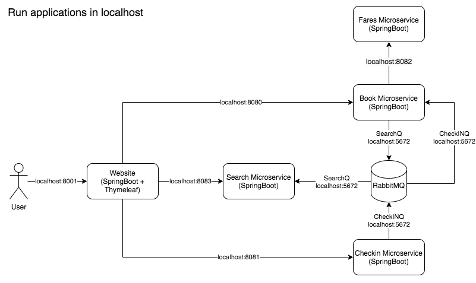
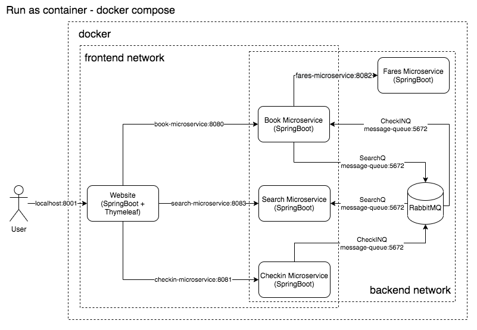
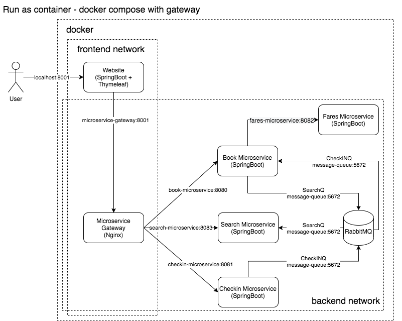

# Architecture

```bash
# Solution 1 - manually run the microservice one by one
run-manually.sh

# Solution 2 - run applications in localhost
## check if sets of microservices ports are occupied before trigger to start
## write log into _log logging file while booting the microservices
## write processor PID into run.pid after booted the microservices
## stop rabbitmq container
## check of docker container and microservices booting status while they are booting in background
## only the pre-condition application is done then trigger the next one to start
run-all.sh

## check the processor if running before kill it
## kill microservices processors
## stop rabbitmq container
run-all-stop.sh

* 本例子有wait for dependencies脚本在"run-all.sh"
```



```bash
# Solution 3 - run as container - docker compose
run-docker-compose.sh
|- run-docker-build.sh
|- docker-compose.yml
run-docker-compose-down.sh

## runtime
docker-compose -> container -> docker-entrypoint.sh -> java -jar -> SpringBoot2 application
```



```bash
# Solution 4 - run as container - docker compose with gateway
run-docker-compose-gateway.sh
|- run-docker-build.sh
|- docker-compose-gateway.yml
run-docker-compose-gateway-down.sh

* 本例子有wait for dependencies脚本在"docker-entrypoint.sh"
* 参考等待依赖微服务脚本 - https://docs.docker.com/compose/startup-order/
* 例子3利用Spring profile去控制使用docker对应的hostname, 而非localhost
* 例子4利用变量默认值 (在application.properties和bash script), 传入gateway的环境变量, 从而导致website访问gateway, 而不是单独的微服务 (默认值是例子3的微服务hostname)
* 在gateway是使用Nginx做了反向代理
```



```bash
# clean all resources
run-cleanup-all.sh
```

# 回顾分析使用docker-compose遇到的依赖问题

- 问题描述
  - 案例代码在微服务启动时候, 有执行`CommandLineRunner`导致了有启动依赖的问题.
  - 本来是打算使用docker-compose达到依赖启动的目的的.
  - 但是docker-compose只针对容器ready的状态, 并没有针对内部的applicatio启动状态的.
  - 尝试过使用`docker-compose-wait`但效果不好, 因为只针对port的检测.
- 解决方案
  - 根据<https://docs.docker.com/compose/startup-order/>手写一个wrapper吧.
  - 同时针对每个微服务写个health check (已经有`actuator`, 可以直接使用那个, 例如 - http://localhost:8001/actuator/health).
  - 具体参考`docker/docker-entrypoint.sh`

分析过程中使用的一些命令.

```bash
# 检查website是否启动成功
docker logs -f website

# 在docker-compose启动website失败后, 手动启动并成功
# 如果容器配置, 例如entrypoint配置有问题, 该命令不会成功, 需要--entrypoint /bin/sh覆盖entrypoint配置
docker run -it --rm --network backend -p 8001:8001 shijian/website
docker exec -it website /bin/sh # 查看网路情况, 是否可以ping book-microservice

docker run -it --rm --network backend -p 8080:8080 shijian/book-microservice
docker run -it --rm --name book-microservice shijian/book-microservice
docker exec -it book-microservice /bin/sh 

# 登录检查容器内部 - 覆盖entrypoint配置
## 使用root用户登录
docker run -it --rm --network backend -p 8001:8001 --entrypoint /bin/sh shijian/website
docker run -it --rm --network backend -p 8080:8080 --entrypoint /bin/sh shijian/book-microservice
/bin/sh /app/docker-entrypoint.sh
## /bin/sh -c /app/docker-entrypoint.sh # 这个失败
## 使用spring用户登录
docker run -it --rm --network backend -p 8080:8080 --entrypoint /bin/sh --user spring shijian/book-microservice
```
