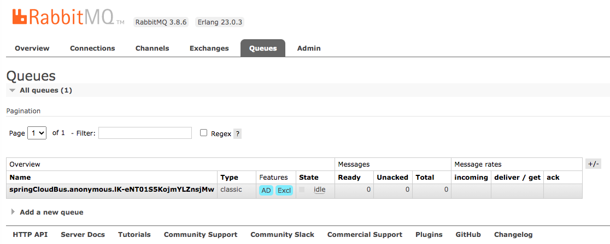

# Architecture

```bash
# Solution 1 - manually run the microservice one by one
run-manually.sh

# few scripts for testing and testing endpoint
run-test-config-server.sh
run-test-eureka-server.sh
run-test-health.sh
run-test-rabbitmq.sh
run-test-refreshscope.sh

# few jvm profiling tools
run-profile-jvm.sh
```


## Spring Cloud Bus



## Eureka server architecture

```bash
# 1. standalone
run-all-eureka-1-standalone.sh
```


```bash
# 2. cluster
run-all-eureka-2-cluster.sh
```


```bash
# 3. with load balancer
run-all-eureka-3-with-load-balancer.sh
```


## All microservices

```bash
# Solution 2 - run all microservice
run-config-repo-setup.sh # 由于config server要指向Git仓库, 设立本地仓库
run-config-repo-clean.sh # 清除本地仓库
run-all-functions.sh # 相关启动和检验的公共函数

run-all.sh
|- run-all-functions.sh
|- run-all-stop.sh
|- run-config-repo-setup.sh

run-all-mini.sh # run-all.sh子集, 构建最小化微服务环境
|- run-all-functions.sh
|- run-all-stop.sh
|- run-config-repo-setup.sh
```


## All microservice - high availability

```bash
# Solution 3 - run high availability architecture
## load balancers for config server, eureka server, and website
run-all-ha.sh # 高可用架构
|- run-all-functions.sh
|- run-all-stop.sh
|- run-config-repo-setup.sh

run-all-ha-optimized.sh # 高可用架构 - 内存优化版本
|- run-all-functions.sh
|- run-all-stop.sh
|- run-config-repo-setup.sh
```


```bash
# clean all resources
run-all-stop.sh # 关闭所有运行资源
|- run-config-repo-clean.sh
```

# 技术选型

## Spring Cloud对应的SpringBoot版本

- <https://start.spring.io/actuator/info>

```json
{"spring-cloud": {
"Finchley.M2": "Spring Boot >=2.0.0.M3 and <2.0.0.M5",
"Finchley.M3": "Spring Boot >=2.0.0.M5 and <=2.0.0.M5",
"Finchley.M4": "Spring Boot >=2.0.0.M6 and <=2.0.0.M6",
"Finchley.M5": "Spring Boot >=2.0.0.M7 and <=2.0.0.M7",
"Finchley.M6": "Spring Boot >=2.0.0.RC1 and <=2.0.0.RC1",
"Finchley.M7": "Spring Boot >=2.0.0.RC2 and <=2.0.0.RC2",
"Finchley.M9": "Spring Boot >=2.0.0.RELEASE and <=2.0.0.RELEASE",
"Finchley.RC1": "Spring Boot >=2.0.1.RELEASE and <2.0.2.RELEASE",
"Finchley.RC2": "Spring Boot >=2.0.2.RELEASE and <2.0.3.RELEASE",
"Finchley.SR4": "Spring Boot >=2.0.3.RELEASE and <2.0.999.BUILD-SNAPSHOT",
"Finchley.BUILD-SNAPSHOT": "Spring Boot >=2.0.999.BUILD-SNAPSHOT and <2.1.0.M3",
"Greenwich.M1": "Spring Boot >=2.1.0.M3 and <2.1.0.RELEASE",
"Greenwich.SR6": "Spring Boot >=2.1.0.RELEASE and <2.1.17.BUILD-SNAPSHOT",
"Greenwich.BUILD-SNAPSHOT": "Spring Boot >=2.1.17.BUILD-SNAPSHOT and <2.2.0.M4",
"Hoxton.SR7": "Spring Boot >=2.2.0.M4 and <2.3.4.BUILD-SNAPSHOT",
"Hoxton.BUILD-SNAPSHOT": "Spring Boot >=2.3.4.BUILD-SNAPSHOT and <2.4.0.M1",
"2020.0.0-SNAPSHOT": "Spring Boot >=2.4.0.M1"
}}
```

## 后Netflix时代的方案替代品

- Hystrix -> Resilience4j
- Hystrix Dashboard / Turbine -> Micrometer + Monitoring System
- Ribbon -> Spring Cloud Loadbalancer
- Zuul 1 -> Spring Cloud Gateway
- Archaius 1 -> Spring Boot external config + Spring Cloud Config

# Spring Cloud特点

- distributed
- fault-tolerant
- self-healing capabilities

Spring Cloud uses a bootstrap context, which is a parent context of the main application. Bootstrap context is responsible for loading configuration properties from the Config Server. The bootstrap context looks for `bootstrap.yaml` or `bootstrap.properties` for loading the initial configuration properties.

# Config Server for external configuration

指定的配置目录一定要是git目录, 即具备`.git`内容

- 访问配置文件
  - 格式 - http://localhost:8888/${applicationName/serviceId}/${profile}/${opetional, git label}
  - 以下等价
    - http://localhost:8888/application/default
    - http://localhost:8888/application/master
    - http://localhost:8888/application/default/master

# Eureka for registration and discovery

Once registered, the service endpoint sends ping requests to the registry every 30 seconds to renew its lease. 
If a service endpoint cannot renew its lease for a few times, that service endpoint is taken out of the service registry.

The Eureka internally uses Ribbon for load balancing.

- Dynamic registration is primarily from the service provider's point of view.
- Dynamic discovery is applicable from the service consumer's point of view.

# Zuul proxy as the API Gateway

The Zuul proxy internally uses the **Eureka Server** for service discovery,
and **Ribbon** for load balancing between service instances.

The Zuul proxy is also capable of routing, monitoring, managing resiliency, security,
and so on. In simple terms, we can consider Zuul as a reverse proxy service.
